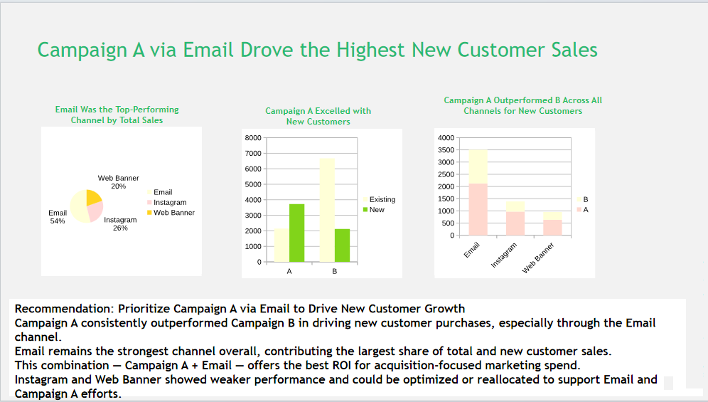

# bcgx-data-decision-makers-simulation
Campaign performance analysis - BCGX Job Simulation on Forage
# BCGX - Introduction to Data for Decision Makers Job Simulation (Forage)

Completed BCGX's job simulation analyzing campaign performance data and communicating actionable insights.

## What I did
- Built pivot tables in Excel to analyze sales by campaign, channel, and customer type
- Identified Campaign A (via Email) as the top performer for new customer acquisition
- Created a PowerPoint recommendation slide summarizing findings and business recommendation

## Key Findings
- **Total Sales:** $14,659.60 (Campaign A: $5,869.56 | Campaign B: $8,790.04)
- **By Channel:** Email led with $7,909.31 in total sales
- **New Customers:** Campaign A drove $3,726.99 vs Campaign B's $2,117.44
- **Recommendation:** Prioritize Campaign A via Email to drive new customer growth — it consistently outperformed Campaign B, and Email remains the strongest channel overall.

## Presentation Slide

## Files
- `BCGX_Sales_Analysis.xlsx` — pivot table analysis

## Certificate
[View my certificate](BCG_certificate.pdf)

Credential ID: uYKxgnC89keBq9YyH
